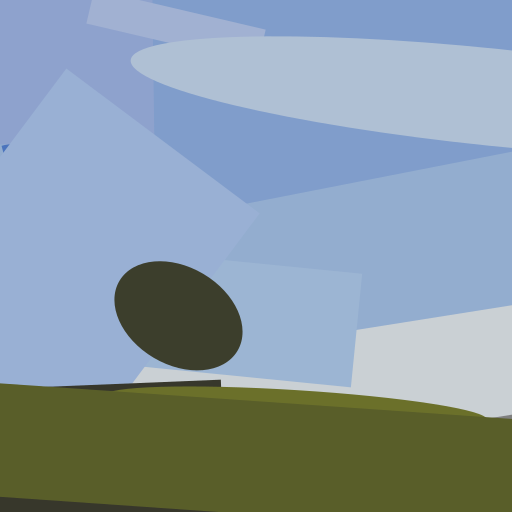
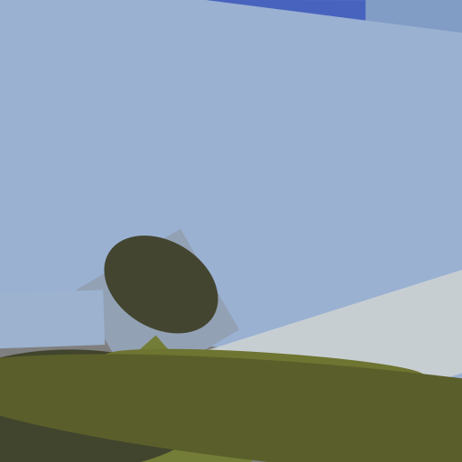
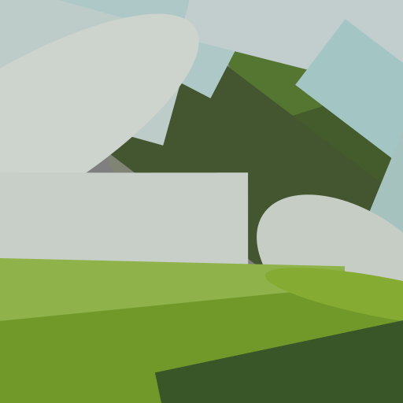
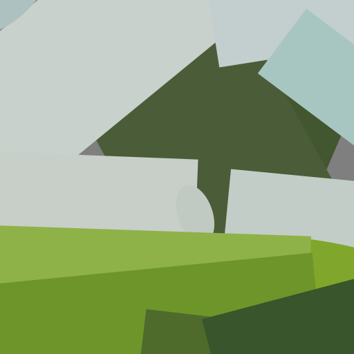
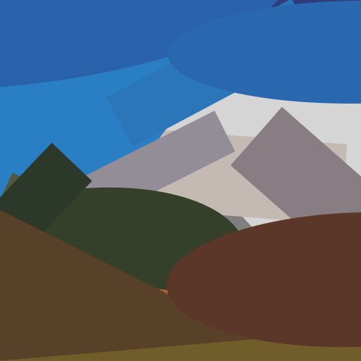
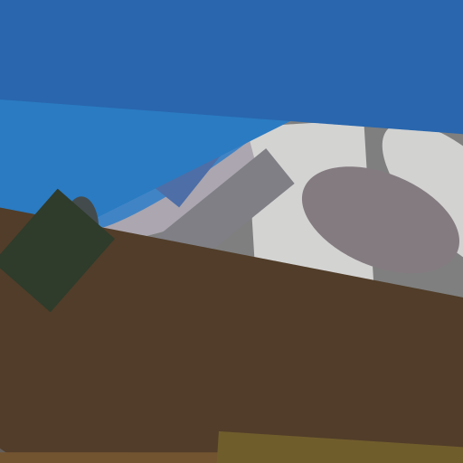

# AbstractionNet

Image abstraction using sortable squircles.

Training on CelebA dataset:

https://user-images.githubusercontent.com/17656709/147105272-b9d991ea-9edb-4d75-a320-c147c17a3bfd.mp4

Training for 1 minute on a single image without using a neural network:

|        Input image                          | Abstracted (using L1 loss)                                                   | Abstracted (using L2 loss)                                                   |
|---------------------------------------------|------------------------------------------------------------------------------|------------------------------------------------------------------------------|
|  |  |  |
|  |  |  |
|  |  |  |
